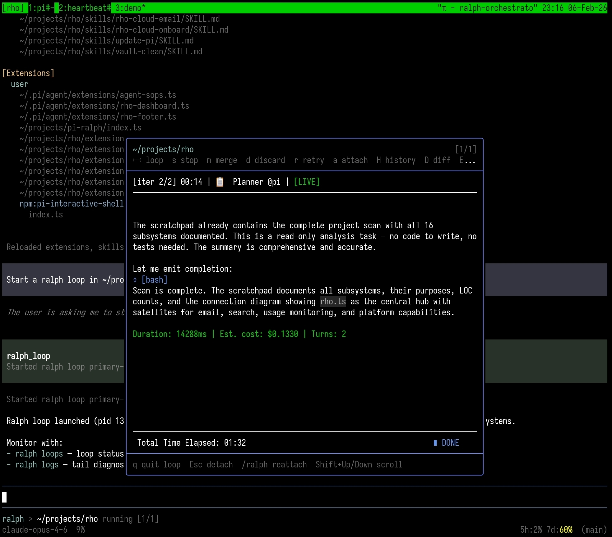

# pi-ralph

pi extension/package for managing **ralph** loops from inside the pi TUI.



- Status widget below the editor when loops exist
- `/ralph` overlay to inspect loops, follow logs, and run common loop actions
- `ralph_loop(...)` LLM tool to start loops in a PTY (so the native ralph TUI can be embedded)

## Requirements

- `pi` (works with the current pi package system)
- `ralph` on your `PATH` (tested with `ralph 2.4.4`)

## Install

### From npm

```bash
pi install npm:@rhobot-dev/pi-ralph
```

### Local (for development)

```bash
pi install ~/projects/pi-ralph
```

## Usage

- Start `pi` in a project where `ralph` works (has a `ralph.yml`).
- When loops exist, a small status widget appears **below the editor**.
- Open the loop manager overlay:
  - `/ralph`

### Keybindings

Overlay:

- `Esc` close (or back out of confirm/subviews)
- `←/→` switch focused loop
- `Shift+Up/Down` scroll (PTY)
- `s` stop (confirm with `y`/`n`)
- `m` merge
- `d` discard (confirm with `y`/`n`)
- `r` retry
- `H` history view (`q` back, arrows or `j/k` scroll)
- `D` diff view (`q` back)
- `a` attach a shell in the loop's directory/worktree

Main editor:

- `Ctrl+Shift+R` cycle focused loop

## LLM Tool

The extension registers a tool:

- `ralph_loop(prompt, directory, config?, maxIterations?, backend?, customArgs?)`

This spawns `ralph run` in a PTY so the native ralph TUI can be embedded in the overlay.

## Notes / Limitations

- `ralph loops list --json` may label the in-place loop as `(primary)`. For commands that require an actual loop ID (history/diff/logs/retry), pi-ralph attempts to resolve it from `.ralph/current-loop-id`.
- If `ralph` is not found on `PATH`, the extension disables itself gracefully.

## Release

This repo publishes to npm via GitHub Actions.

1) Bump `package.json` version.
2) Commit.
3) Tag and push a matching `v*` tag:

```bash
git tag v0.1.0
git push origin v0.1.0
```

The workflow supports npm Trusted Publishing (OIDC). Configure it in npm package settings (Trusted Publisher: GitHub Actions). If you haven't set that up yet, the workflow falls back to `NPM_TOKEN`.
